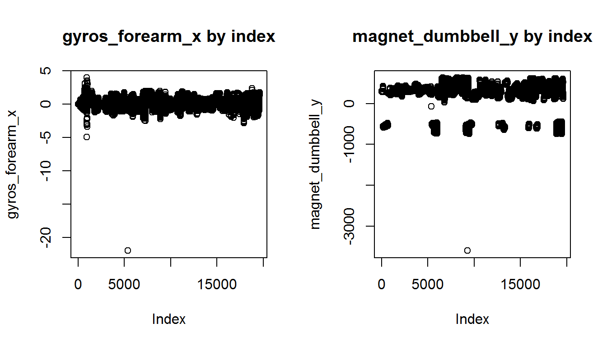

#Predicting weight lifting exercises
####André Martinez Lima
####May 2015


<br />


##Abstract


Using the [Weight Lifting Exercises data set](http://groupware.les.inf.puc-rio.br/har#weight_lifting_exercises), I clean the data, separate the [training set provided](https://d396qusza40orc.cloudfront.net/predmachlearn/pml-training.csv) into a training set (60%) and a test set (40%). I then train a random forest model using the training set, and use the test set to get an out of sample error estimate. I estimate the error rate to be 0.6%.

<br />

##Cleaning the Data


The original training set is stored in the `originalTraining` object, and the original testing set is stored in the `originalTesting` object.
  

The data is composed of 19622 observations of 160 variables. However, many of these variables do not have any values in the [final test set provided](http://d396qusza40orc.cloudfront.net/predmachlearn/pml-testing.csv). As such, I started by removing the columns where all the observations for that particular variable were missing (NAs). These columns were removed from both training and test sets.


```r
columns <- which(!apply (is.na(originalTesting), 2, all))
originalTraining <- originalTraining[, columns]
originalTesting <- originalTesting[, columns]
```

<br />

On the original training set, two more operations were performed. First, I removed the first 7 columns since they were not relevant for this exercise. They consist of IDs, timestamps, and other information that does not determine how an exercise is being performed.


  
The second operation involved removing outliers. After making many exploratory plots, the rows 5373 and 9274 were found to have significantly high values in a few variables, and as such I removed them from the training set. Here is an example for each of these rows:


```r
par(mfrow = c(1, 2))
with(originalTraining, plot(gyros_forearm_x, main = "gyros_forearm_x by index"))
with(originalTraining, plot(magnet_dumbbell_y, main = "magnet_dumbbell_y by index"))
```



<br />

Now I clean the training set:


```r
originalTraining <- originalTraining[-c(5373, 9274), -c(1:7)]
```
<br />


##Machine Learning Algorithm


Having cleaned the training set, I can now divide it in two:   


* a training set, composed of 60% of the observations, on which I will train the model; 
* a test set, composed of 40% of the observations, on which I will get my out of sample error estimate.


<br />


```r
set.seed(123)
inTrain <- createDataPartition(y = originalTraining$classe, p = 0.6, list = FALSE)
train <- originalTraining[inTrain,]
test <- originalTraining[-inTrain,]
```


Since the `randomForest` function in the `randomForest` package performs cross-validation by itself (bootstrapping), there is no need to create a validation set. We choose to do a random forest model because of its high accuracy and because the outcome is a multi-class variable.


<br />

The model I chose to fit is the following:


```r
set.seed(123)
modrf <- randomForest(classe ~., data = train)
modrf
```

```
## 
## Call:
##  randomForest(formula = classe ~ ., data = train) 
##                Type of random forest: classification
##                      Number of trees: 500
## No. of variables tried at each split: 7
## 
##         OOB estimate of  error rate: 0.6%
## Confusion matrix:
##      A    B    C    D    E  class.error
## A 3347    0    0    0    1 0.0002986858
## B   13 2260    4    0    1 0.0079016681
## C    0   18 2034    2    0 0.0097370983
## D    1    0   23 1905    1 0.0129533679
## E    0    0    2    5 2158 0.0032332564
```


This model predicts an out-of-bag error rate of 0.6%.

<br />


##Out of Sample Error


  
The error measure will be the error rate, which is simply `1 - accuracy`. To calculate this, I predict the classe values of the test set and then compare them to the actual values of those observations. This can be done with the `predict` and `confusionMatrix` functions.   


First, I will calculate the error rate in the training set used to train the model.


```r
trainpred <- predict(modrf, train)
confusionMatrix(trainpred, train$classe)$overall[1]
```

```
## Accuracy 
##        1
```


I get an accuracy of 1, which means the error rate is 0. Since this was the set used to train the model, its error rate is an optimistic estimate of the actual error rate. I expect the error rate to be higher than 0.   
  
  
<br />
  
  
A better estimate of the error rate would be the out of sample error rate. To calculate it, I now use the test set which is composed of the 40% of the original training set that was not used to train the model.


```r
testpred <- predict(modrf, test)
confusionMatrix(testpred, test$classe)$overall[1]
```

```
##  Accuracy 
## 0.9938815
```


The estimated error rate is then 1 minus 0.9939, which is 0.0061, or 0.61%. This value is consistent with the out-of-bag error rate returned by the model.


